```{r setup, include=FALSE}
knitr::opts_chunk$set(echo = FALSE)
```

## 1 Critique of Original Visualization
The original visualization is shown below.


### 1.1	Clarity
- The title and the y-axis of the graph does not show the unit of the trade value. In the dataset, the trade value has two kinds of units, which is thousand dollars and million dollars. So it might make people confused if we do not specify the unit of the value.
- The label of x-axis is month of period, but in fact the x-axis shows different years not different month.
- The original visualization used area chart which could misleading people to compare the height of import and export in the chart. However, the chart has two different y-axis for import and export and their scale is also different.

### 1.2	Aesthetic
- The title and the graph are not aligned.
- The width of charts for different regions are not the same.
- The x-axis uses tick marks on categorical scale.
- The color of the area makes the overlapped part of the trend line not very clear to see.
- The two different y-axis for import and export are not differentiated by color.

## 2 Makeover Design
The makeover design is shown below:

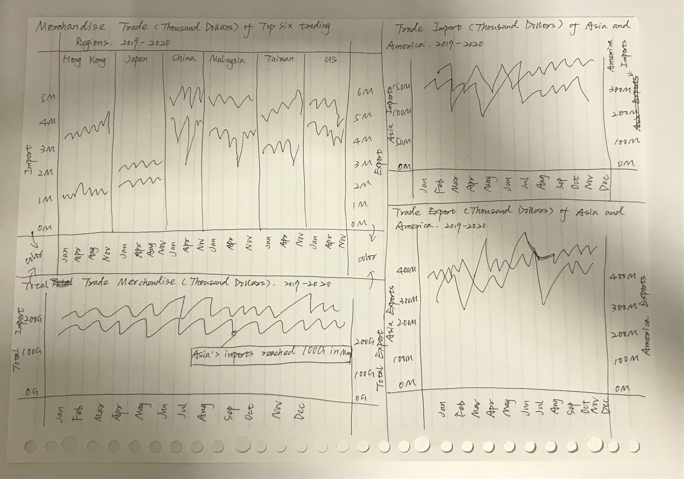

### 2.1	Clarity
- The unit of the trading values is added to the sheet title, which is thousand dollars. And all the numerical data in the dataset is already convert to this unit.
- The x-axis represent month and the label of axis is revised accordingly.
- Instead of using area chart, the makeover design used lines to represent the data.
- The average reference lines are added to make it easier to see the scale of the data.
- A tooltip is added to highlight the key information at each data point.

### 2.2	Aesthetic
- The title and the graph are set to be aligned.
- The width of charts for different regions are set to be the same.
- The x-axis removed original tick marks.
- The two different y-axis for import and export are differentiated by using different color.

## 3 Proposed Visualization
The makeover visualization on Tableau Public is published [here](https://public.tableau.com/app/profile/yingfang.liang/viz/DataViz1_16223744492730/MerchandiseTradeDashboard).

## 4 Step-by-step Guide
1.	Remove the text information above T1 and T2

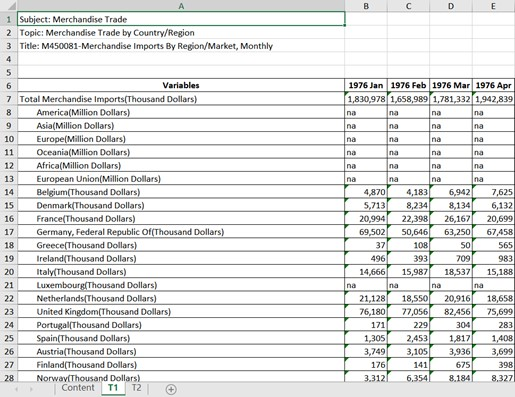

2.	Remain data from 2019 to 2021 and delete the rest part of the data  

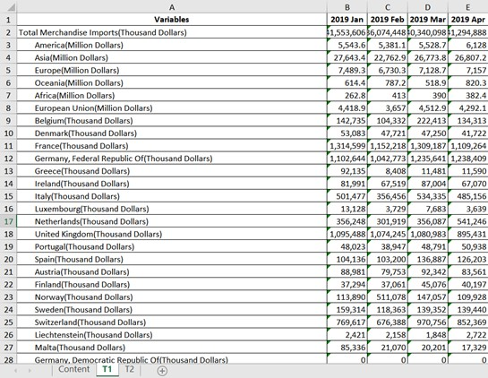

3.	Select all the data, click on the yellow exclamation mark and choose Convert to Number to convert the original data from text to number

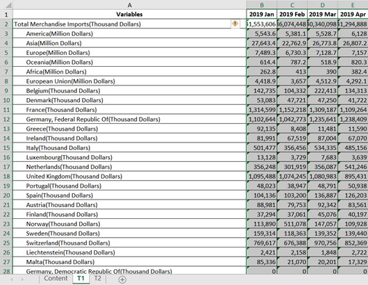
 
4.	Move the top seven statistic rows to other new sheets, remove those rows from original sheet and rename the sheets

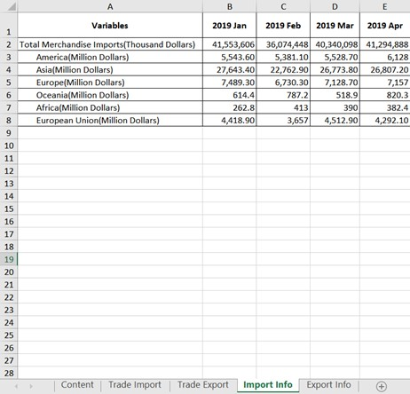
 
5.	Remain the rows of the top six trading countries and delete the rest of the data. Transpose the table and rename the columns as shown below

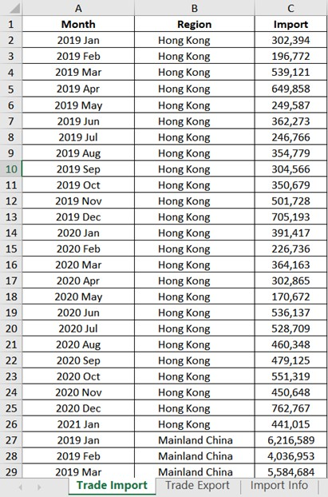
 
6.	Combine the Import table, Export table and statistic information tables into one big table

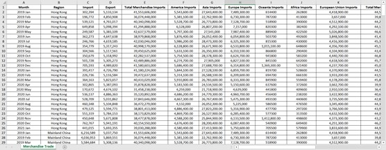
 
7.	Import the processed data into Tableau

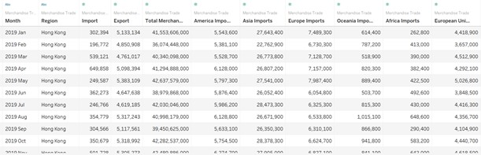
 
8.	Add Import to Rows and Month to Columns

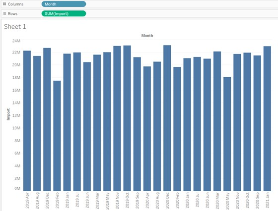
 
9.	Change the Marks from Automatic to Line

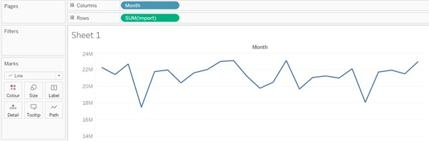
 
10.	Add Export to Rows near by Import and add Region to Columns

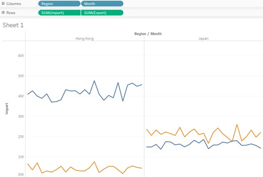
 
11.	Fit the width for the worksheet and adjust the size of the axis a little bit

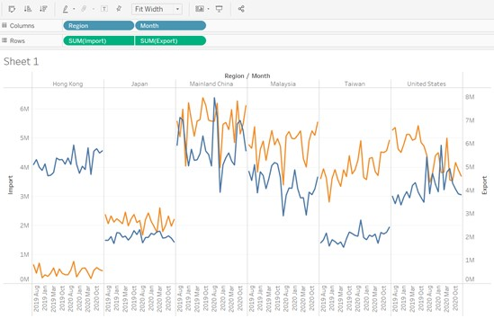
 
12.	Click on the small triangle on the right of Measure Names, choose Edit Colours and change the color of Import line to red to make it looks clear

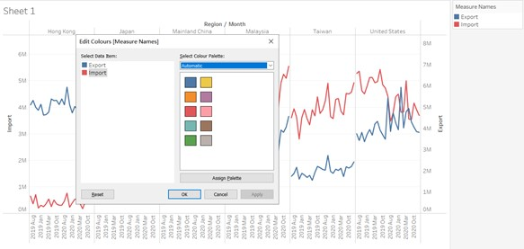
 
13.	Right click on the Import y-axis, choose Format, select the font dropdown list under Default and change it to red. Repeat the same thing to change the color of Export y-axis to blue
 
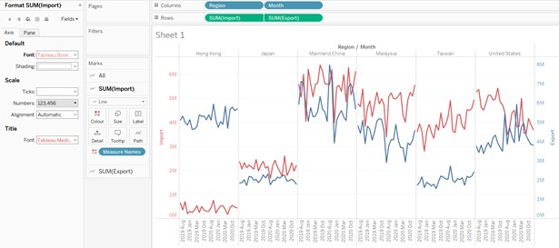
 
14.	Right click on the Import y-axis, choose Add Reference Line, remain the Value as Average, change the dropdown list of Label to Custom and format it as Avg and the average value. Change Line to a thin dotted line and change the color of the line to a lighter red. Repeat the same things for Export y-axis.
 
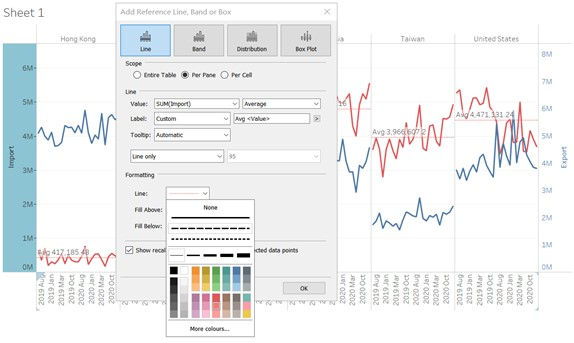
 
15.	Select SUM(Import) in the Marks panel and click on Tooltip. Format the content of tooltip as shown below and use different font size and color to highlight the key information. Repeat the same things for SUM(Export).
 
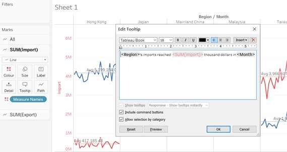
 
16.	Hide Field Labels for Columns

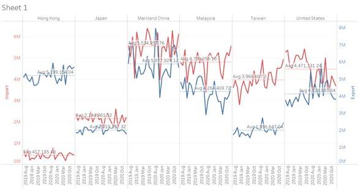
 
17.	Rename the sheet title

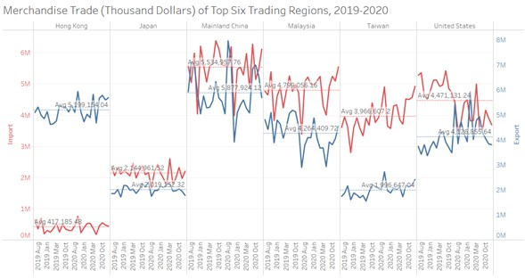
 
18.	Sort the Month in a correct order

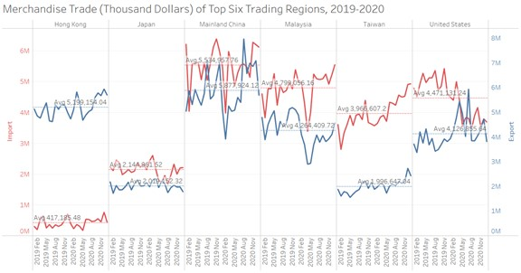
 
19.	Change the sheet name


 
20.	Create a new sheet and rename it Imports of Asia and America


 
21.	Add Asia Imports and America Imports to Rows and add Month to Columns. Change Marks from Automatic to Line

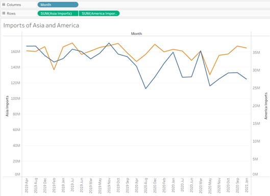
 
22.	Fit Width and resize the graph a little bit

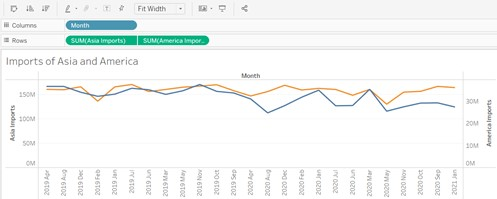
 
23.	Change the color of y-axis according to the color of the lines

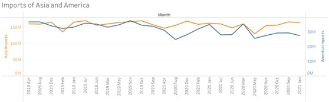
 
24.	Format the content of tooltip as following

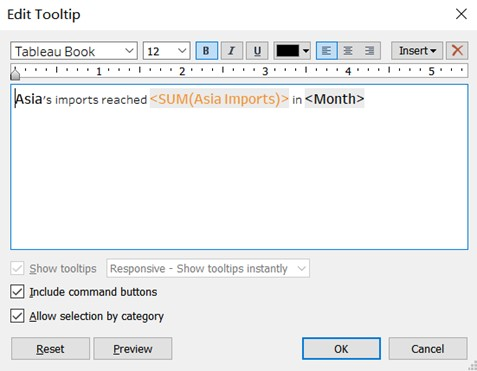
 
25.	Hide Field Labels for Columns

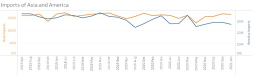
 
26.	Rename the sheet title

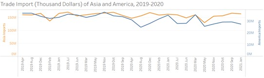
 
27.	Sort the Month in a correct order

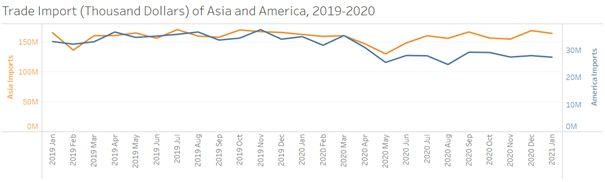
 
28.	Repeat the same things to create a new sheet for Asia Exports and America Exports

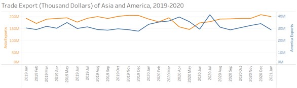
 
29.	Repeat the same things to create a new sheet for Total Merchandise Imports and Total Merchandise Exports

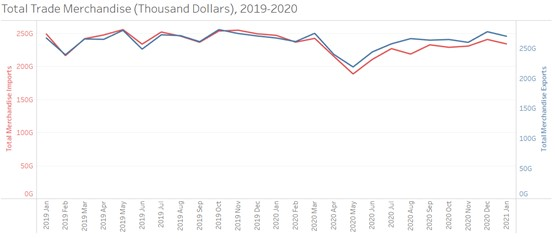
 
30.	Create a Dashboard and put the four worksheets created above into it. Set the Size as Automatic

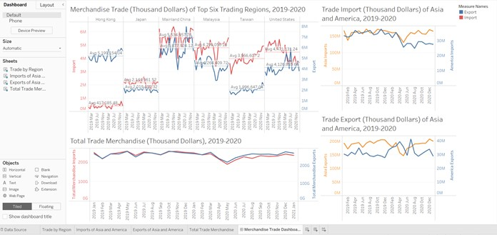

## 5 Derived Insights

1.	We can see that there is a significant decline trend between 2020 March and 2020 May both in Asia and worldwide. For the total merchandise trade, the trade imports decreased around 22% and trade exports decreased around 20%, which changed just within two months. This might due to the breakout of Covid throughout the world. And we can refer to the chart of Mainland China, there is also a dramatic decrease from the end of 2019 to the first quarter of 2020, which may due to that the breakout of Covid in China is earlier than in the other countries.
2.	The scale of imports and exports of Hong Kong is very different, the imports of Hong Kong between 2019 and 2021 is only around 1M thousand dollars, but the exports reached around 5M thousand dollars, nearly 5 times of imports. This may because Hong Kong is a free-trade port and its trading policy is much different with China Mainland, which makes it easier to do some export trading.
3.	Observing the chart of US, we can see that the exports of US increased rapidly from the end of 2019 to early 2020, compared with 2019 September, the exports increased more than 56%. One reason may be that the government published several policies to increase the exports to China in order to reduce the trading deficit.
