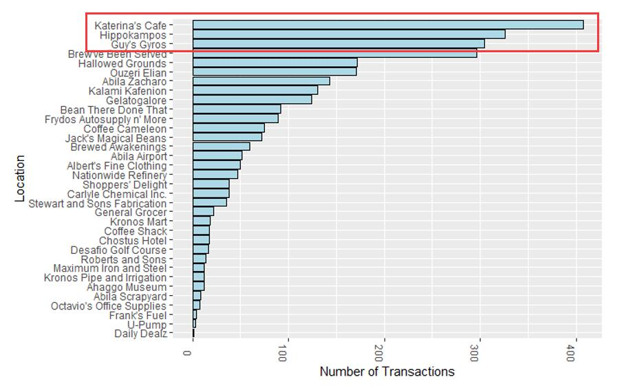
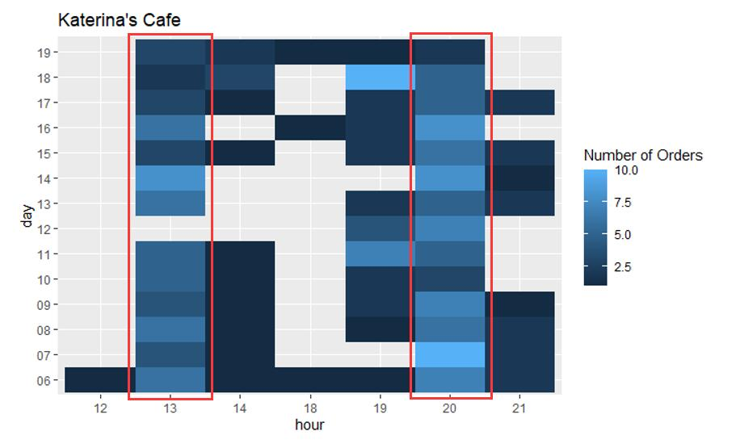
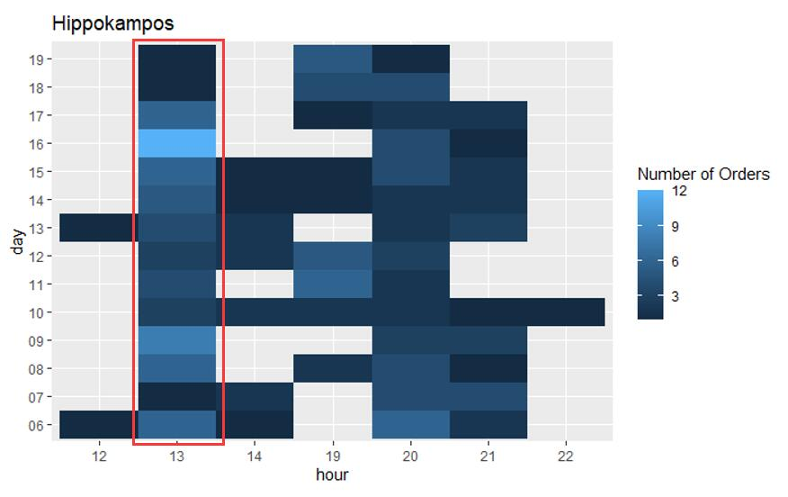
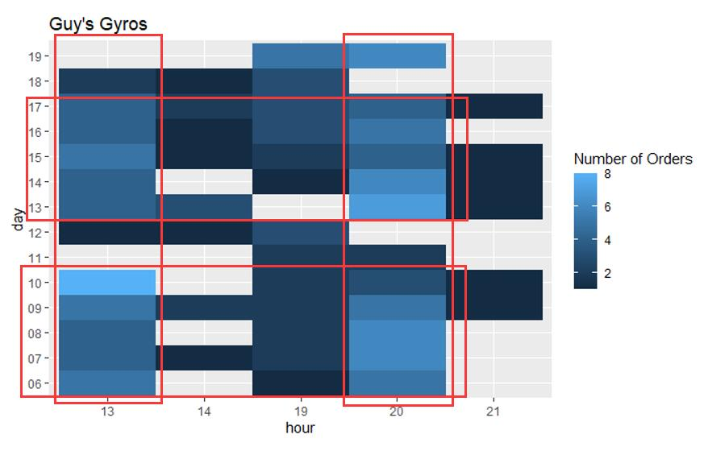
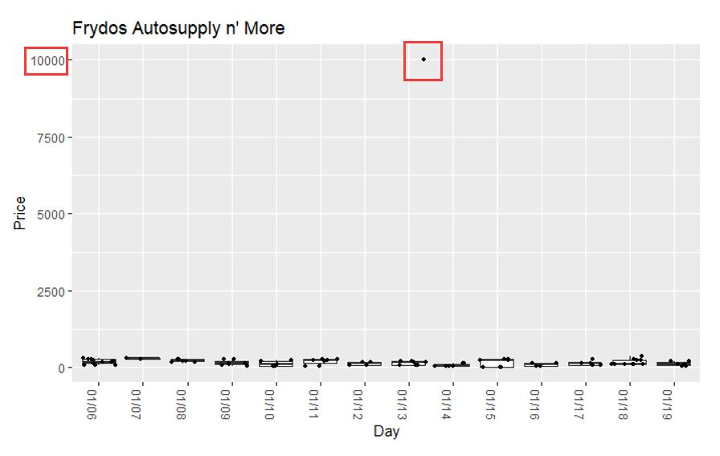
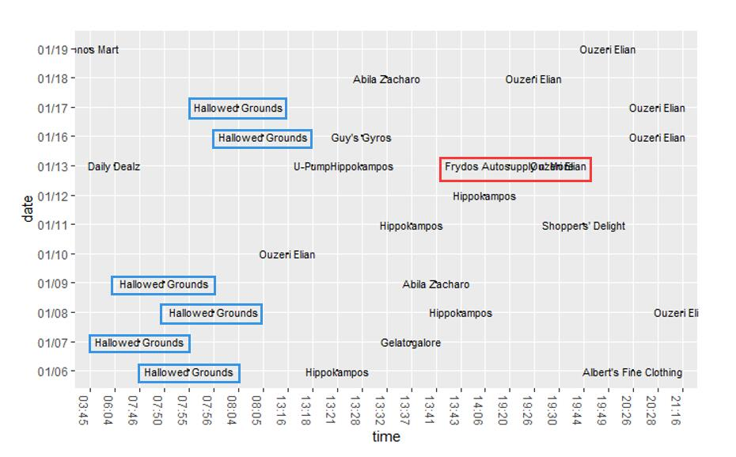
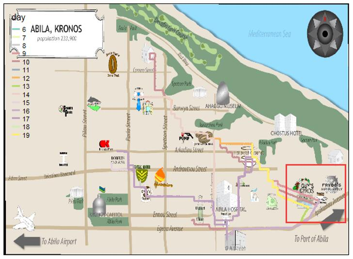
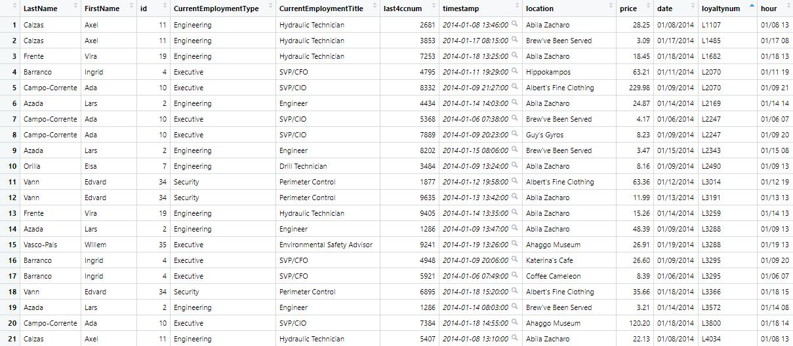
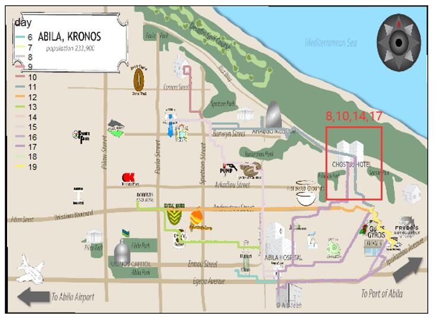

```{r setup, include=FALSE}
knitr::opts_chunk$set(echo = FALSE)
```

# 1 Background

## 1.1 Overview

Many of the Abila, Kronos-based employees of GAStech have company cars which are approved for both personal and business use. Those who do not have company cars have the ability to check out company trucks for business use, but these trucks cannot be used for personal business.

Employees with company cars are happy to have these vehicles, because the company cars are generally much higher quality than the cars they would be able to afford otherwise. However, GAStech does not trust their employees. Without the employees? knowledge, GAStech has installed geospatial tracking software in the company vehicles. The vehicles are tracked periodically as long as they are moving.

This vehicle tracking data has been made available to law enforcement to support their investigation. Unfortunately, data is not available for the day the GAStech employees went missing. Data is only available for the two weeks prior to the disappearance.

To promote local businesses, Kronos based companies provide a Kronos Kares benefit card to GASTech employees giving them discounts and rewards in exchange for collecting information about their credit card purchases and preferences as recorded on loyalty cards. This data has been made available to investigators in the hopes that it can help resolve the situation. However, Kronos Kares does not collect personal information beyond purchases.

## 1.2 Requirment

We must cope with uncertainties that result from missing, conflicting, and imperfect data to make recommendations for further investigation.

Use visual analytics to analyze the available data and develop responses to the questions below.

## 1.3 Tasks and Questions

1.  Using just the credit and loyalty card data, identify the most popular locations, and when they are popular. What anomalies do you see? What corrections would you recommend to correct these anomalies? Please limit your answer to 8 images and 300 words.

2.  Add the vehicle data to your analysis of the credit and loyalty card data. How does your assessment of the anomalies in question 1 change based on this new data? What discrepancies between vehicle, credit, and loyalty card data do you find? Please limit your answer to 8 images and 500 words.

3.  Can you infer the owners of each credit card and loyalty card? What is your evidence? Where are there uncertainties in your method? Where are there uncertainties in the data? Please limit your answer to 8 images and 500 words.

4.  Given the data sources provided, identify potential informal or unofficial relationships among GASTech personnel. Provide evidence for these relationships. Please limit your response to 8 images and 500 words.

5.  Do you see evidence of suspicious activity? Identify 1- 10 locations where you believe the suspicious activity is occurring, and why Please limit your response to 10 images and 500 words.

# 2 Methodology

## 2.1 Most Popular Locations

### 2.1.1 Data Preparation

```{r echo = FALSE}
library(ggplot2)
library(tidygraph)
library(ggraph)
library(igraph)
library(lubridate)
library(plotly)
library(ggiraph)
library(raster)
library(sf)
library(tmap)
library(clock)
library(tidyverse)
library(rgdal)
```

We firstly need to import the two csv file containing credit card and loyalty card transaction data.

```{r echo = TRUE}
cc_data <- read_csv("cc_data.csv")
loyalty_data <- read_csv("loyalty_data.csv")
```

In order to count credit card transaction and loyalty card transaction together, cc_data and loyalty_data is merged to get an overall transaction_data.

```{r echo = TRUE}
transaction_data = merge(cc_data, loyalty_data, all=TRUE)
```

### 2.1.2 Visualization

The total number of transactions at different locations are displayed by a bar chart. In order to sort the location name by their sales respectively, we write a re-order function to sort the y-axis.

```{r echo = TRUE}
reorder_size <- function(x) {
  factor(x, levels = names(sort(table(x))))
}      

ggplot(data = transaction_data, 
       aes(y = reorder_size(location))) + 
  geom_bar(color = "black",
           fill = "light blue") + 
  theme(axis.text.x = element_text(angle = 270)) + 
  xlab("Number of Transactions") + 
  ylab("Location") 
```

## 2.2 Popular Time Period

A heatmap is used here to show the distribution of transactions in different days to detect the peak hour of different shops. We get the popular location names from the result of previous part and select the corresponding transaction data. Two new columns hour and day is added to work as the x-axis and y-axis of this graph.

```{r echo = TRUE}
name <- names(sort(table(transaction_data$location), decreasing = TRUE)[1])

most_pop <- cc_data[cc_data$location == name,]
most_pop$timestamp <- strptime(most_pop$timestamp, format='%m/%d/%Y %H:%M')

most_pop <- most_pop %>%
  mutate(most_pop, hour = strftime(most_pop$timestamp, format='%H')) %>%
  mutate(most_pop, day = strftime(most_pop$timestamp, format='%d'))

groups <- group_by(most_pop, day, hour)
values = summarise(groups, n())

ggplot(data = values, 
       aes(x = hour,
           y = day,
           fill = `n()`)) + 
  geom_raster() + 
  labs(fill = "Number of Orders")
```

## 2.3 Order Price Distribution

Since we want to detect anomalies in these locations, we not only cares about their total sales but also want to know the amount of each order. A box plot is designed to show the distribution of price of each order. A new column day is added since we want to see that distribution in different days. 

```{r echo = TRUE}
most_pop_transaction <- transaction_data[transaction_data$location == name,]
most_pop_transaction$timestamp <- strptime(most_pop_transaction$timestamp, format='%m/%d/%Y')
most_pop_transaction <- most_pop_transaction %>%
  mutate(most_pop_transaction, day = strftime(most_pop_transaction$timestamp, format='%m/%d'))

ggplot(data = most_pop_transaction, 
       aes(x = day,
           y = price)) + 
  geom_boxplot(outlier.shape = NA) + 
  geom_point(position = "jitter", 
             size = 1) + 
  theme(axis.text.x = element_text(angle = 270)) + 
  xlab("Day") + 
  ylab("Price")
```

## 2.4 Matching Credit Card and Loyalty Card

Each credit card record should have a corresponding loyalty card record for it.Since credit card and loyalty card have different format of timestamp, we firstly create a new column called date to solve this inconsistency. Then we use inner join to combine the two types of card into one card_data.

```{r echo=TRUE}
cc_data$timestamp <- strptime(cc_data$timestamp, format='%m/%d/%Y %H:%M')
loyalty_data$timestamp <- strptime(loyalty_data$timestamp, format='%m/%d/%Y')

cc_data <- cc_data %>%
  mutate(cc_data, date = strftime(cc_data$timestamp, format='%m/%d/%Y'))
loyalty_data <- loyalty_data %>%
  mutate(loyalty_data, date = strftime(loyalty_data$timestamp, format='%m/%d/%Y'))

card_data <- cc_data %>% inner_join(loyalty_data,
                                    by=c('location','price','date'))
```

According to the data, we can see that not everyone used both credit card and loyalty card, so we need to add those credit card data without corresponding loyalty card to this card_data.

```{r echo=TRUE}
all_card_data <- merge(card_data, cc_data, all.y=TRUE) %>%
  select(timestamp,location, price,last4ccnum,date,loyaltynum)
```

## 2.5 GPS Path Visulaization

To detect the suspicious activities of employees, a gps data visualization is designed to show the activity path for different car id (car owner). A map picture of Abila is used as the background image and we draw the path of different cars in different days on it.

```{r}
bgmap <- raster("Geospatial/MC2-tourist.tif")

Abila_st <- st_read(dsn = "Geospatial",
                    layer = "Abila")

gps <- read_csv("gps.csv")


gps$Timestamp <- date_time_parse(gps$Timestamp,
                                 zone = "",
                                 format = "%m/%d/%Y %H:%M:%S")
gps$day <- as.factor(get_day(gps$Timestamp))
gps$id <- as_factor(gps$id)

gps_sf <- st_as_sf(gps, 
                   coords = c("long", "lat"),
                   crs= 4326)


gps_path <- gps_sf %>%
  group_by(id, day) %>%
  summarize(m = mean(Timestamp), 
            do_union=FALSE) %>%
  st_cast("LINESTRING")


gps_path_selected <- gps_path %>%
  filter(id == 1)

tmap_mode("view")
tm_shape(bgmap) +
  tm_rgb(bgmap, r = 1,g = 2,b = 3,
       alpha = NA,
       saturation = 1,
       interpolate = TRUE,
       max.value = 255) +
  tm_shape(gps_path_selected) +
  tm_lines(col = "day",
           lwd = 3) 
```

## 2.6 Matching Car Data and Transaction Data

Since employees are happy to use company cars for both personal and business cases, we can assume that most of the purchase activities should 
have gps records before and after them. We firstly extract the timeslot information from both gps data and card data by taking the hour of 
each timestamp, then we try to combine these two kinds of data lies in the same timeslots. After merging the two data table together, 
for each card, we count the number of matched records for each car id and rank them decreasingly. The car id with the largest number of matched records is most likely to be the owner of the card. Finally, we join this data with the car assignment data to get the personal information of each car owners.

```{r echo=TRUE}
gps <- read_csv("gps.csv")
gps$Timestamp <- date_time_parse(gps$Timestamp,
                                 zone = "",
                                 format = "%m/%d/%Y %H:%M:%S")
gps_data <- gps %>%
  mutate(gps, hour = strftime(gps$Timestamp, format='%m/%d %H'))

all_card_data = merge(card_data, cc_data, all.y=TRUE) 
all_card_data <- all_card_data %>% 
  mutate(all_card_data, hour = strftime(all_card_data$timestamp, format='%m/%d %H'))
all_card_data <- all_card_data %>%
  select(timestamp,location, price,last4ccnum,date,loyaltynum, hour)

gps_card_data <- merge(gps_data, all_card_data, by='hour', all.y=TRUE)

card_groups <- group_by(gps_card_data, last4ccnum, id)
card_match = summarise(card_groups, n())

distinct_card_match <- group_by(card_match, last4ccnum) %>% 
  filter(`n()` == max(`n()`))

car_assignment = read_csv("car-assignments.csv")
colnames(car_assignment)[3] <- "id"

total_match = inner_join(car_assignment, distinct_card_match, by="id") %>% 
  select(LastName, FirstName, id, CurrentEmploymentType, CurrentEmploymentTitle, last4ccnum)

final_match = inner_join(total_match, all_card_data, by="last4ccnum") 
final_match <- distinct(final_match, id, last4ccnum, loyaltynum, .keep_all = TRUE)
```

## 2.7 Transaction Location Distribution

In order to detect the daily routine and frequently show-up locations for different people (card owner), we draw the location names in a timeline for different date. This graph can be used together with the gps path visualization.

```{r echo=TRUE}
cc_data <- cc_data %>%
  mutate(cc_data, date = strftime(cc_data$timestamp, format='%m/%d')) %>%
  mutate(cc_data, time = strftime(cc_data$timestamp, format='%H:%M'))

cc_data_selected <- cc_data %>% 
  filter(last4ccnum == 9551)

ggplot(cc_data_selected, 
       aes(x = time, 
           y = date,
           fill = date)) +
  geom_point(
    aes(data_id = last4ccnum),
        size = 0.1) + 
  geom_text(aes(label = location),
            size = 3) +
  theme(axis.text.x = element_text(angle = 270),
        legend.position = "none")
```

# 3 Answer

## Question 1

### Most Popular Location

According to the total number of transactions, we can see that the top-3 popular locations in this area are Katerina's Cafe,
Hippokampos and Guy's Gyros.



When we refer to the heatmap of their transaction distribution, we found that they basically share the same popular timeslot.
13 pm and 20 pm are the peak hour for these three shops, for Hippokampos, it is a little bit less popular compared with 
the other two shops in dinner time. For Katerina's Cafe and Hippokampos, their sales do not have much difference between weekday and weekend. 
However, Guy's Gyros seems more popular in weekdays as shown in the graph.





### Anomalies 

After go through all the boxplots for price of orders in different locations, we can find Frydos Autosupply n' More has one very 
strange transaction in Jan 13. The average order price is around 200 to 300 in this location, but we can see the price of 
this suspicious transaction reached 10000, which is nearly 50 times of the average amount. If this is not caused by operating error, then 
that may involved money laundering for those kidnappers.



## Question 2

### Combine Card Data and Vehicle Data



The suspicious transaction we detected in question 1 is made by credit card 9551. After visualizing the locations this person 
frequently goes, we found one daily routine of this person is to stop off at Hallowed Grounds to grab some coffee before work. 
Since we don't successfully match this credit card with its corresponding car owner, we can only match the daily activity 
pattern of this person with the gps path data and the car owner of car 8 (Lucas Alcazer) is the most likely one.



However, according to the gps path data, we found that Lucas has never been to Frydos Autosupply n' More during these 14 days. And when we refer to the previous graph again, it shows that this person stop his coffee routine from Jan 10 to Jan 13. So if we combine the information of these 
two kinds of data together, it indicates this card may not be used by its original owner from Jan 10 to Jan 13.

### Discrepancies between Data

1. Not every one use both credit card and loyalty card or always use them at the same time, so we can not always match the transactions of 
these two cards together.

2. Some people may not always go out by driving their own car. Sometimes their friends might give them a ride. So we can see some purchase activities without corresponding gps data matching them.

3. The GPS devices of some cars are not working very well. Sometimes there can be some small gaps between gps path without any 
purchase activities. 

## Question 3

### Identifying Card Owner

The matching result is as shown below:



### Uncertainties 

All the discrepancies between data discussed in the previous part can effect the accuracy of this method. Apart from that, sometimes people 
may stop by one location for a long time like hours and only make one purchase in between, in this senario, the purchase activity and the driving 
records may not be in the same timeslot. For those cards we can not successfully matched a owner, we need to analyze its activity pattern with each gps path to find the answer.

## Question 4

### Potiential Relationship

Elsa Orilla (car id 7) and Brand Tempestad (car id 33) may be in a relationship. They show up at Chostus Hotel together multiple times 
(in Jan 8, 10, 14, 17). According to the gps data, we can see that both of them drive their own car and most of the time they don't come from 
the same places, so it is more likely that they have an affair instead of being couples.



## Question 5

### Suspicious Activities


